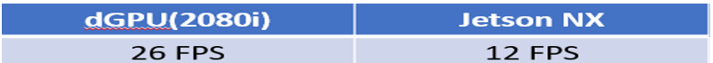

*****************************************************************************
* Copyright (c) 2019-2021 NVIDIA Corporation.  All rights reserved.
*
* NVIDIA Corporation and its licensors retain all intellectual property
* and proprietary rights in and to this software, related documentation
* and any modifications thereto.  Any use, reproduction, disclosure or
* distribution of this software and related documentation without an express
* license agreement from NVIDIA Corporation is strictly prohibited.
* 
*****************************************************************************
# Instroduction

This deepstream-segmentation-analytics application uses the Nvidia DeepStream-5.1 SDK
to generate the segmentation ground truth JPEG output to display the industrial component defect.
It simulates the real industrial production line env.. The apps run 24 hours / day until it is shut off.
This version of the apps can also be run under the Nvidia internal helm-chart env. after setting the production=0 in the user defined input file.

# Prequisites:

Please follow instructions in the apps/sample_apps/deepstream-app/README on how
to install the prequisites for Deepstream SDK, the DeepStream SDK itself and the
apps.

One must have the following development packages installed
  *  GStreamer-1.0  
  *  GStreamer-1.0 Base Plugins  
  *  GStreamer-1.0 gstrtspserver  
  *  X11 client-side library  
  *  DeepStream-5.1 SDK : https://docs.nvidia.com/metropolis/deepstream/dev-guide/index.html

# DeepStream Pipeline 
  * DeepStream SDK is based on the GStreamer framework. GStreamer is a pipeline based multimedia framework that links together a wide variety of media processing systems to complete workflows. Following is the pipleline for this segmentation application. It supports for both binary and multi class model for the segmentation.

# This DeepStream Segmentation Apps Overview
  * The usr_input.txt gethers the user input information as example as following:

    * batch_size - how many images will need going through the segmentation process for a stream directory

    * width - the output jpg file width (usually same as the input image width)

    * height -the output jpg file height (usually same as the input image height)

    * stream0 - /path/for/the/images0/dir. stream1, streamN will be in the same fasion. 

    * pro_per_sec - repeat the segmentation run after how many seconds. N/A to helm-chart env. case

    * no_streams - how many stream dirs are in the env.

    * production - 1 for real production env. case. 0 for the Nvidia internal helm-chart env. 

  * each time of apps run, it will go through all the stream directory, i.e, stream0, stream1, streamN to perform a batch size image segmentation   

  * To perform a batch size image access for the stream0, stream1, streamN, if the image dir. is exmpty, it will not do anything

  * After an image is read from a stream dir., then it will be deleted in that dir. 

  * The output jpg file will be saved in the masks directory with the unique name while the input file will be saved in input directory

  * The saved output and input files can be used for the re-training purpose to improve the segmentation accuracy

  * If production=0 (for helm-chart env.), then the input images will not be deleted while no files will be saved in the input and mask dir. Also the out.jpg file as the segmentation ground truth file will be save in the directory in case for view. 

    

 

 # Nvidia Transfer Learning Toolkit 3.0 (Training / Evaluation / Export / Converter)

  * Please read the Nvidia TLT-3.0 document : https://developer.nvidia.com/tlt-get-started

  * Please follow https://docs.nvidia.com/metropolis/TLT/tlt-user-guide to download TLT Jupyter Notebook and TLT converter 

  # Nvidia Transfer Learning Toolkit 3.0 User Guide on the UNET Used for the Segmentation
  
   * https://docs.nvidia.com/metropolis/TLT/tlt-user-guide/text/semantic_segmentation/unet.html#training-the-model

  * Use the Jupyter Notebook for the UNET training based on the DAGM-2007 Dataset on Class7

  * Use the TLT to generate the .etlt and .enginer file for the DeepStream application deployment

  * For the DAGM-2007 Class7 dataset[1], it misses the mask file as training label for each good image (without defect) 

  * One need to create a black grayscale image as a mask file for the good images without defect in order to use TLT for re-training

  * dummy_image.py can be used to create the above mentioned mask file

  

# Deploying the Apps to DeepStream-5.1 Using Transfer Learning Toolkit-3.0 

  * Use the .etlt or .engine file after TLT train, export, and coverter

  * Use the Jetson version of the tlt converter to generate the .engine file used in the Jetson devices

    Generate .engine file as an example: ./tlt-converter -k $key -e trt.fp16.tlt.unet.engine -t fp16 -p input_1 1,1x3x320x320, 4x3x320x320,16x3x320x320 model_unet.etlt  
    here: $key is the key when do the tlt train and 320x320 is the input/training image size as example

  * Define the .etlt or .engine file path in the config file for dGPU and Jetson for the DS-5.1 application

  * example:  model-engine-file = ../../models/unet/trt.fp16.tlt.unet.engine in dstest_segmentation_config_industrial.txt

  

# How to Compile the Application Package
  * git clone this application into /opt/nvidia/deeepstream/deepstream-5.1/sources/apps/sample_apps

  * $ cd deepstream-segmentation-analytics

  * $ make

# How to Run this DeepStream Segmentation Application 

  * make the models dir. in the deepstream-segmentation-analytics and copy the trt.fp16.tlt.unet.engine (as example) into models dir.

  * $ ./deepstream-segmentation-analytics -c dstest_segmentation_config_industrial.txt -i usr_input.txt  -for binary segmentation

  * $ ./deepstream-segmentation-analytics -c dstest_segmentation_config_semantic.txt -i usr_input.txt  -for multi class 

  * The program run will generate the output jpg as the masked ground truth after the segmentation which is saved in the masks directory.

      

 
 
 
 # The performance using different GPU devices

  

# References

  * [1] All the images are from the DAGM 2007 competition dataset: https://www.kaggle.com/mhskjelvareid/dagm-2007-competition-dataset-optical-inspection

  * [2] DAGM-2007 License information reference file:  CDLA-Sharing-v1.0.pdf
 
  * [3] Nvidia DeepStream Referenced Unet Models: https://github.com/qubvel/segmentation_models 
  
  * [4] The example Jupyter Notebook program for Unet training process
        https://github.com/qubvel/segmentation_models/blob/master/examples/binary%20segmentation%20(camvid).ipynb

